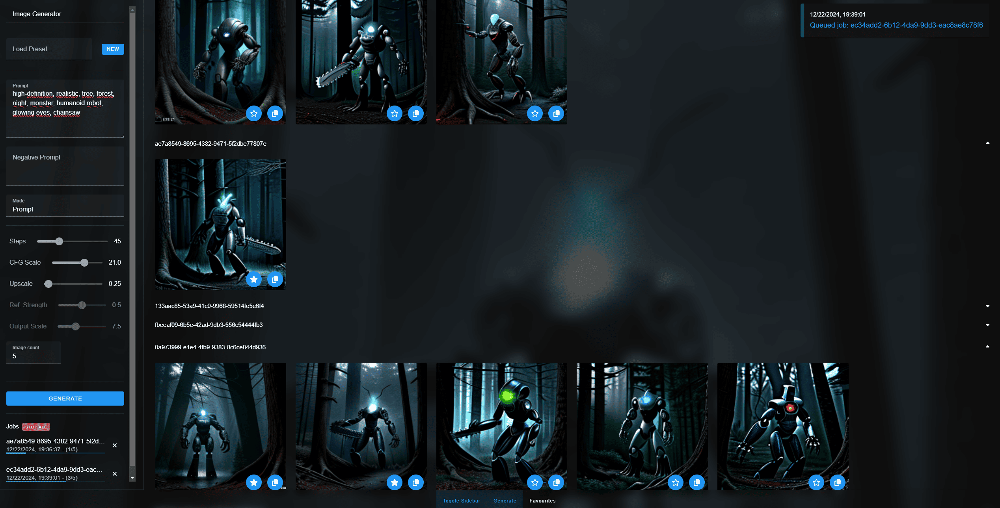

# SD-1.5 Image Generator

The SD-1.5 Image Generator provides a WebSocket interface for generating images using
the [Stable Diffusion 1.5 model](https://huggingface.co/stable-diffusion-v1-5/stable-diffusion-v1-5) or any model
derived from it. Additionally, a user-friendly web interface, built with Vue.js, allows users to save their favorite
generated images locally in IndexedDB. The system is designed for optimal performance on CUDA, with fallback support for MPS (Mac) or CPU-based processing.



---

## Technologies

- **Backend**:
    - Python 3.10
- **Frontend**:
    - Node 20
    - Vue.js v3.5
    - Pinia
    - Vuetify

---

## Setup Instructions

> **Note:** This setup is intended for development purposes and is not suited for production use.

### 1. Frontend Configuration

- If you want to use the backend within the Docker container, do **not** copy the .env.example file, Docker will set the
  environment automatically.

### 2. Model Setup

- Place your base model file (e.g. `v1-5-pruned-emaonly.safetensors` for SD-1.5) in the `backend/models` folder.

### 3. Backend Configuration

- Copy the `.env.example` file in the backend folder to `.env` and adjust the `APP_BASE_MODEL_PATH` variable to point to
  your base model file.

### 4. Optional: Additional Safetensors Files

- You can add other safetensors model files to the `backend/models` folder and update the `APP_SAFETENSOR_FILES`
  variable in the `.env` file with the paths to these files. Paths should be separated by semicolons (`;`).
- The additional safetensors will be loaded into the model automatically.

### 5. Set a Secure WebSocket Token

- Set a secure value for the `APP_WS_TOKEN` variable in the `.env` file.

### 6. Build and Run

- If you want to disable GPU-support, remove the 'deploy' block within the `backend` service in the `docker-compose.yml` file.
- Execute the following command to build and start the application:
    ```bash
    docker-compose up --build
    ```

### 7. Have fun

* The web-interface will be available at [http://localhost:80](http://localhost:80) by default.

---

**Example payload for the WebSocket**

```js
payload = {
    api_token:           'super_secret_token',
    command:             'generate_from_reference',
    prompt:              'A beautiful sunset over the mountains',
    negative_prompt:     'high quality, realistic',
    reference_image:     'data:image/png;base64,/9j/4QAYRXhpZgAASUkqAAgAAAAAAA..',
    steps:               50,
    cfg_scale:           7.5,
    upscale:             0.25,
    image_count:         8,
    prompt_output_scale: 7.5,
    ref_image_strength:  0.5
};
```